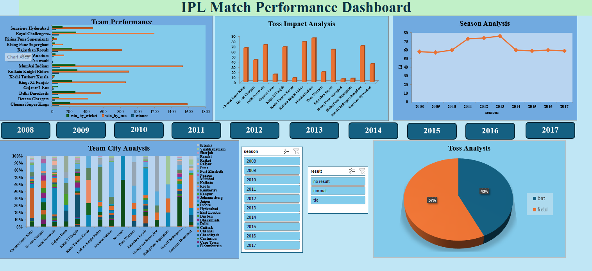
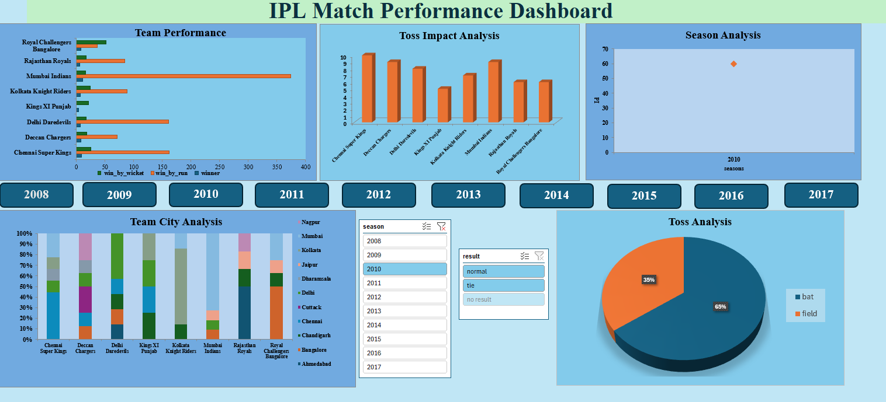
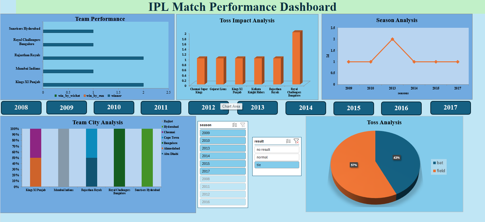

# 🏏 IPL Match Performance Dashboard

An interactive Microsoft Excel dashboard analyzing 800+ Indian Premier League (IPL) matches across 15+ seasons to uncover key insights into team performance, win trends, toss impact, and franchise comparisons.

---

## 📹 Video Walkthrough & Dashboard Screenshots

### 🎥 Dashboard Demo
https://github.com/lekshmi001/IPL_Dashboard-using-Excel/raw/main/ipl%20dashboard.mp4

> **Note:** If the video preview above does not play natively in your browser, you can view or download the demo directly via [ipl dashboard.mp4](./ipl%20dashboard.mp4).

### 📸 Dashboard Screenshots
| Dashboard Image 1 | Dashboard Image 2 | Dashboard Image 3 |
| :---: | :---: | :---: |
|  |  |  |

---

## 🎯 Project Overview

This project transforms raw multi-season IPL match logs into actionable metrics. By evaluating historical performance trends across 10+ franchises, the dashboard provides a clear picture of team consistency, venue advantages, and strategic toss decisions.

---

## 🔑 Key Features & Insights

* **Large Dataset Analysis:** Analyzed 800+ matches spanning 15+ seasons using [`ipl dataset.xlsx`](./ipl%20dataset.xlsx).
* **Franchise Comparative Analysis:** Evaluates team win rates, head-to-head metrics, and seasonal growth across 10+ franchises.
* **Toss Impact Analysis:** Highlights the statistical correlation between winning the toss and match outcomes (batting vs. fielding decisions).
* **Dynamic Interactivity:** Filter metrics dynamically by season, venue, team, or match outcome using connected Slicers and KPI Cards.

---

## 🛠️ Tools & Excel Techniques Used

* **Microsoft Excel:** Advanced Data Cleaning, Data Validation, Structuring, and Reporting.
* **Core Techniques:** Dynamic Pivot Tables, Pivot Charts, Custom Slicers, KPI Cards, and Conditional Formatting.
* **Formulas & Functions:** `XLOOKUP`, `INDEX/MATCH`, `SUMIFS`, `COUNTIFS`, and `NESTED IF` statements.

---

## 📁 Repository Files

* **`ipl dataset.xlsx`** — Complete Excel workbook containing raw/processed data and the interactive dashboard.
* **`ipl dashboard.mp4`** — Video walkthrough showcasing dashboard interactivity.
* **`1.png`**, **`2.png`**, **`3.png`** — Dashboard preview images demonstrating key visual tabs and KPI summaries.
